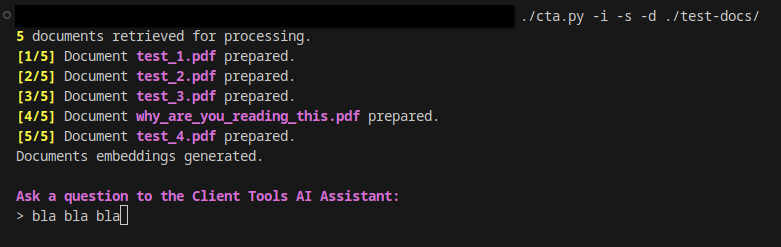

# Client Tools Assistant (CTA)

A local RAG-based AI assistant to retrieve team workflows and processes information from locally stored documents.

## ⚠️ Disclaimer

- This **DOES NOT** contain any actual data, it only has the code to use with your own data.
- This **DOES NOT** provide any trained or finetuned models, it is using out-of-the-box IBM Granite + Nomic Embed
- This is a generic software, it can be used as a generic rag-based LLM. There is no company data in use.
- This is a proof-of-concept. None of the code is finalized, and it will probably change a lot.
- Don't expect any sort of magical working code, I'm not Linus Torvalds.

### 🚀 Primary Technologies Used

- **Ollama**: For the local LLM interface (running locally)
- **IBM Granite-3.3:2b Model**: For the local LLM model (can be configured)
- **nomic-embed-text**: For the local embedding model (can be configured)
- **ChromaDB**: For the local vector database
- **Docling**: For the local document conversion and formatting
- **Rich**: For the CLI user experience

### 🔗 Installation and Setup

1. Install required dependencies
```bash
pip install -r requirements.txt
```

2. Create a docs folder to store your documents:
```bash
cd <my_repo_clone>
mkdir ./docs/
```

3. Run ollama locally:
```bash
ollama serve
```

4. Pull required models:
```bash
ollama pull granite3.3:2b
ollama pull nomic-embed-text:latest
```

### 🏃 Usage



- One-shot prompting: where the prompt is provided through command-line arguments

```bash
./cta.py How do I format a PR commit message? 
```

- Interactive prompting: where the AI can be continuously prompted

```bash
./cta.py --interactive
```

- Prompting with streamed responses: where the AI response is generated in a stream rather than waiting for the entire response to generate

```bash
./cta.py --stream How do I format a PR commit message?
```

- Set a custom directory to pull documentation from (uses `./docs/` by default):

```bash
./cta.py --docs my/path/to/docs/
```

Refer to the cli help instructions here: `./cta.py --help`

```text
A local RAG-based AI assistant to retrieve team workflows and processes information.

Positional Arguments:
  prompt             prompt for the AI assistant

Options:
  -h, --help         show this help message and exit
  -s, --stream       enable streaming generated responses
  -i, --interactive  enable interactive prompting
  -d, --docs DOCS    path to local directory of documents to use for rag prompting
```

### Misc

- You can change the system prompt, llm/embed models, and the default docs directory in the `config.py` file.
- Supported document types:
  - PDF
  - DOCX
  - XLSX
  - HTML

## 💡 Next Steps

- **Code Cleanup**: This code needs to be cleaned up... a lot.
- **Integrations**: A slack bot integration would make this much easier to use.
- **Prompt Improvements**: This still hallucinates sometimes, improved prompt engineering may help. It's rather simple right now.
- **Model Improvements**: There's probably a better model I could use that's within data privacy policy.
- **Automated Document Upload**: A way to automatically hook into new/updated documents instead of manually putting documents into a folder would be helpful.
